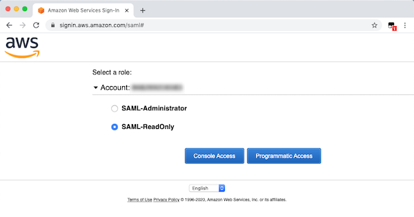
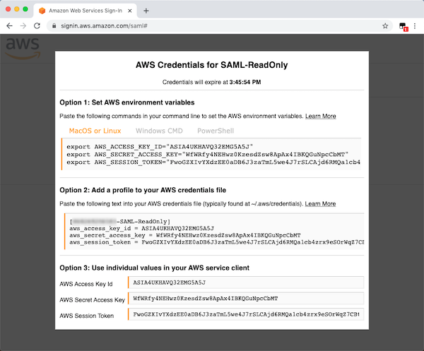

## SAML CLI Userscript

This project contains a [userscript](https://en.wikipedia.org/wiki/Userscript) which modifies the AWS SAML landing page to make it easier to get temporary AWS access keys for programmatic access to AWS services.  This script adds a new button to the SAML landing page which opens a popup containing temporary AWS access keys for the select role.

### AWS Single Sign-On

> [AWS Single Sign-On (SSO)](https://aws.amazon.com/single-sign-on/) makes it easy to centrally manage access to multiple AWS accounts and business applications and provide users with single sign-on access to all their assigned accounts and applications from one place.  [The AWS CLI supports direct integration with SSO](https://docs.aws.amazon.com/cli/latest/userguide/cli-configure-sso.html), which is the recommended approach for authenticating CLI users and provides a much better user experience that the solution in this repo.  
>
> However, if you are not able to use AWS SSO, then the solution in this repo is a valid workaround.


## Installation
1. To use this userscript you need to have a userscript plugin installed in your web browser.  [Tampermonkey](https://tampermonkey.net/) is one popular option which is available for most modern web browsers. 

* [Google Chrome](https://chrome.google.com/webstore/detail/tampermonkey/dhdgffkkebhmkfjojejmpbldmpobfkfo?hl=en)
* [Mozilla Firefox](https://addons.mozilla.org/en-US/firefox/addon/tampermonkey/)
* [Microsoft Edge](https://www.microsoft.com/en-us/p/tampermonkey/9nblggh5162s)


2. After installing Tampermonkey, you will see the Tampermonkey icon in the top right of your browser. Click on the Tampermonkey icon to open the menu, and then click on "Create a new script..."

3. In the editor that opens, paste in the contents of `tampermonkey.js` and then click Save

4. Now when you sign into the AWS Console via your identity provider you will see an additional button at the bottom of the role selection page for "Programmatic Access"

## Usage

> Note: These instructions assume your AWS administrator already integrated your AWS Accounts with your identity provider so that you are able to login to the AWS Console with your corporate credentials

1. After installing the userscript within your chosen web browser, authenticate with your identity provider and select the AWS application.  For example, when using Azure AD/Office 365 you would navigate to http://myapps.microsoft.com/

2. If authentication is successful then you will arrive at the AWS SAML landing page where you will see a new "Programatic Access" button on the page  


3. Select the IAM Role you want to use and then click the "Programmatic Access".  After a second a popup will appear containing temporary access keys for your role  
  


### Session Duration
By default, temporary AWS access keys generated by this userscript last for one hour before expiring.  When your access keys expire you can generate new ones by authenticating through your IDP again, and it's generally recommended to not have access keys last longer than required.

However, if you need to change the session duration of your access keys, there are two options:

1. **Ask your administrator to pass a SessionDuration attribute within your SAML claims**  
  An administrator of your SAML identity provider can pass a SessionDuration attribute within the SAML token, [refer to the AWS Documentation](https://docs.aws.amazon.com/IAM/latest/UserGuide/id_roles_providers_create_saml_assertions.html) for more information. If the SessionDuration attribute is present in your SAML token then the userscript will pick this up automatically.
2. **Override the session duration for specific roles**  
  Within the `tampermonkey.js` file there is an array variable named `SESSION_DURATION_OVERRIDES`. To override the session duration for a specific role, add a new entry within this array where the key is the IAM Role ARN, and the value is the desired session duration in seconds.

  ```javascript
  const SESSION_DURATION_OVERRIDES = {
    'arn:aws:iam::123456789012:role/RoleName': 14400 // Example: 1 hour
  };
  ```

> Note that each IAM Role within AWS specifies its own `MaxSessionDuration`. If the desired duration requested exceeds the allowed MaxSessionDuration then an error will be displayed when clicking on the "Programmatic Access" button. To resolve this, you will need to edit the script again and make the desired duration smaller/shorter.


### Limitations/Future Enhancements
* If the user has access to only one role within AWS, the SAML landing page is automatically skipped during the login flow which means the user has no opportunity to click the "Programmatic Access" button.  In general, most users should have access to a "read only" role in addition to their normal access role which avoids this issue
* Changing the lifespan of temporary AWS access keys by editing the code of the userscript is not very elegant (although this is assumed to be within the ability of most developers who uses AWS access keys regularly). It would be nice to have the session duration selectable within the UI

## License

This library is licensed under the MIT-0 License. See the LICENSE file.
